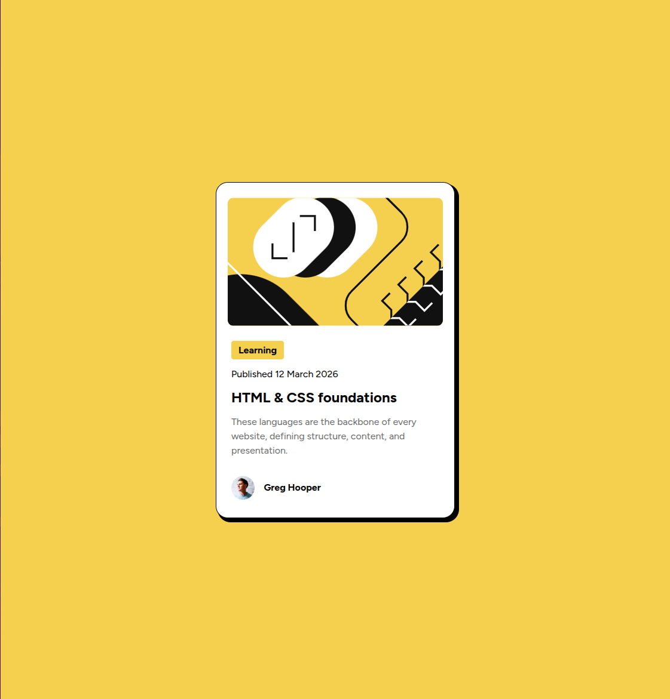
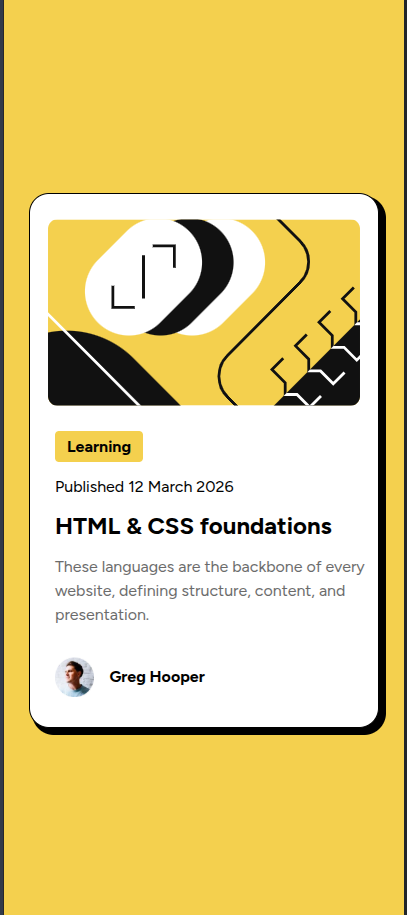

# Frontend Mentor - Blog preview card solution

This is a solution to the [Blog preview card challenge on Frontend Mentor](https://www.frontendmentor.io/challenges/blog-preview-card-ckPaj01IcS). Frontend Mentor challenges help you improve your coding skills by building realistic projects.

## Table of contents

- [Screenshot](#screenshot)
- [Links](#links)
- [Built with](#built-with)
- [What I learned](#what-i-learned)
- [Useful resources](#useful-resources)
- [AI Collaboration](#ai-collaboration)

### Screenshot




### Links

- Live Site URL: [Add live site URL here](https://your-live-site-url.com)

### Built with

- Semantic HTML5 markup
- CSS custom properties
- Flexbox
- Mobile-first workflow

### What I learned

Got to learn a new property, "align-self":

```css
.article-image {
  align-self: center;
  border-radius: 10px;
  margin-bottom: 25px;
  margin-top: 15px;
  width: 95%;
}
```

### Useful resources

- [Example resource 1](https://developer.mozilla.org/en-US/docs/Web/CSS/Reference/Properties/box-shadow) - This helped me for understanding box-shadow property.

### AI Collaboration

- Used GitHub Copilot for understanding bugs and fixed them on my own!
